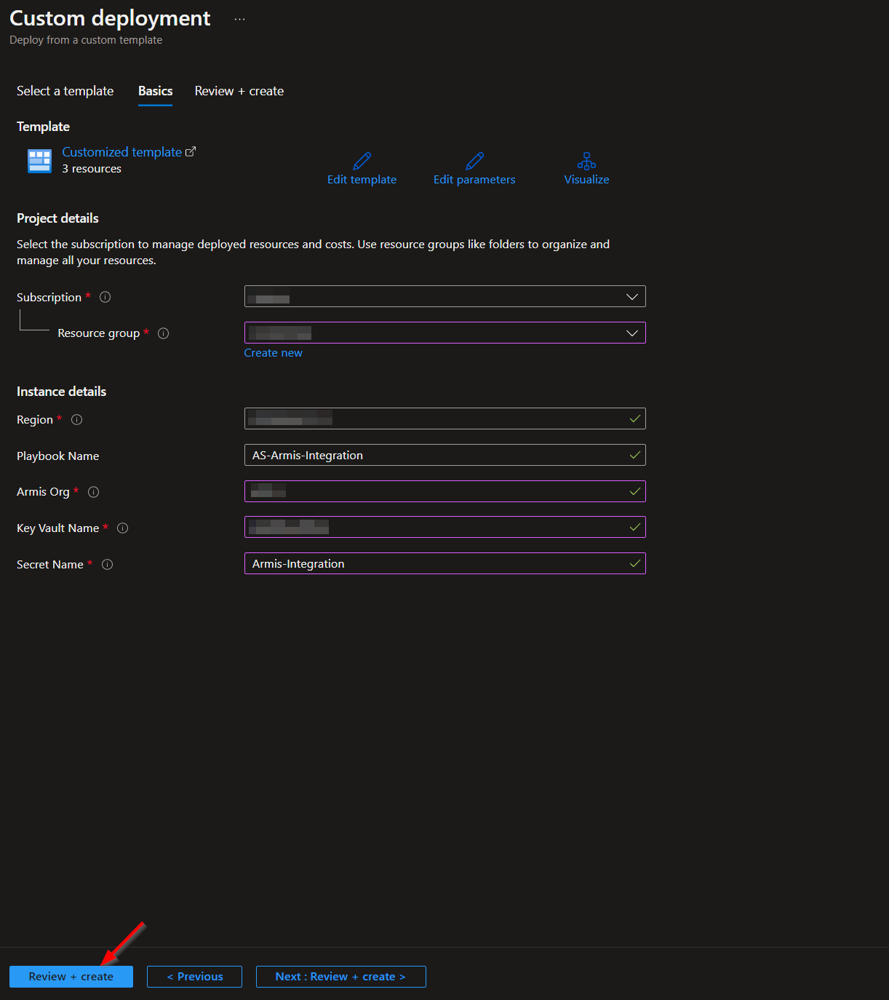
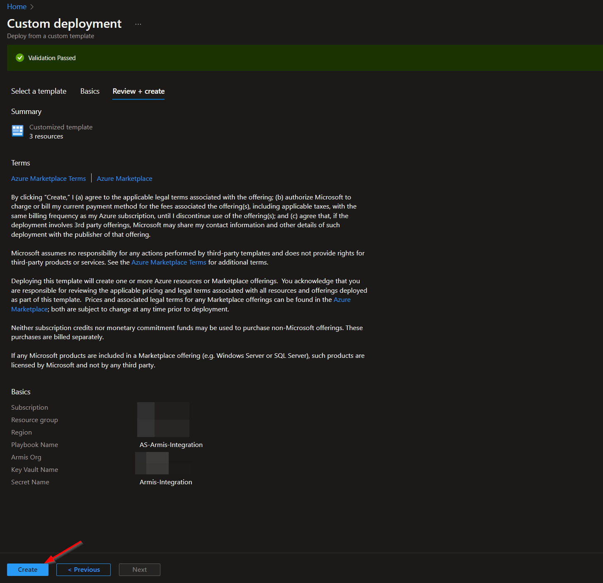
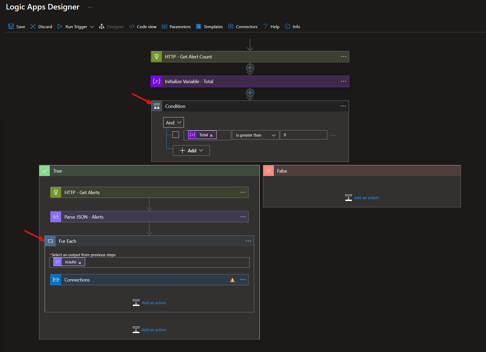
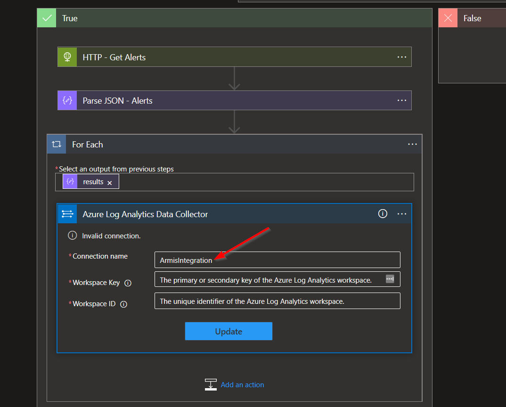

# AS-Armis-Integration

Author: Accelerynt

For any technical questions, please contact info@accelerynt.com  

       

This playbook is intended to be run from Microsoft Sentinel. It will ingest Armis Alerts on a rolling schedule and add them to the Custom Logs in your Microsoft Log Analytics Workspace.
                                                                                                                                     

### Set Up

Before deploying this playbook, your Armis Secret Key, which will be used to obtain access tokens via the Armis API, must be stored in an Azure Key Vault.

Navigate to the Azure Key Vaults page: https://portal.azure.com/#view/HubsExtension/BrowseResource/resourceType/Microsoft.KeyVault%2Fvaults

Navigate to an existing Key Vault or create a new one. From the Key Vault overview page, click the "**Secrets**" menu option, found under the "**Settings**" section.

Click "**Generate/Import**".

Choose a name for the secret and enter the Armis Secret Key in the "**Value**" field. All other settings can be left as is. 

Click "**Create**". 

Once your secret has been added to the vault, navigate to the "**Access policies**" menu option, also found under the "**Settings**" section on the Key Vault page menu. Leave this page open, as you will need to return to it once the playbook has been deployed. See [Granting Access to Azure Key Vault](https://github.com/Accelerynt-Security/AS-Armis-Integration#granting-access-to-azure-key-vault).

                                                                                                 
#
### Deployment                                                                                                         
                                                                                                        
To configure and deploy this playbook:
 
Open your browser and ensure you are logged into your Microsoft Sentinel workspace. In a separate tab, open the link to our playbook on the Accelerynt Security GitHub Repository:

https://github.com/Accelerynt-Security/AS-Armis-Integration

                                             

Click the “**Deploy to Azure**” button at the bottom and it will bring you to the custom deployment template.

In the **Project Details** section:

* Select the “**Subscription**” and “**Resource Group**” from the dropdown boxes you would like the playbook deployed to.  

In the **Instance Details** section:   

* **Playbook Name**: This can be left as “**AS-Armis-Integration**”, or you may change it.  

* **Armis Org**: This is the subdomain in the URL of your Armis org. For example, for the URL **https://[myorg].armis.com**, you would enter "**myorg**" in this field.

* **Key Vault Name**: This is the name of the Azure Key Vault that you have your Armis Secret Key stored in.  

* **Secret Name**: This is the name of the Azure Key Vault Secret container that holds the value of your Armis Secret Key.  

Towards the bottom of the page, click on “**Review + create**”. 

Once the resources have validated, click on "**Create**".

The resources should take around a minute to deploy. Once the deployment is complete, you can expand the "**Deployment details**" section to view them.
Click the one corresponding to the Logic App.

Click on the “**Edit**” button. This will bring you into the Logic Apps Designer.

Before the Logic App can be run, a connection nested in the final step of the Logic App will either need to be authorized, or an existing authorized connection may be alternatively selected. Expand the final step labeled "**Condition**" and then the subsequent "**For Each**" step.

To validate the connection created for this Logic App, expand the "**Connections**" step and click the exclamation point icon next to the name matching the Logic App.
                                                                                                

This will bring up an interface for connecting to the Log Analytics Workspace that will house your Armis Alert Logs. The connection name should be set to "**ArmisIntegration**", or something similar. This will be the custom log name and follows strict naming conventions; spaces and special characters (including dashes) are not permitted.

                                                                                                                                                                                                                                                   
To retrieve your workspace key and id, open a separate tab and navigate to the Microsoft Sentinel page: 
https://portal.azure.com/#view/HubsExtension/BrowseResource/resourceType/microsoft.securityinsightsarg%2Fsentinel

Select the desired workspace. From there, click on "**Settings**". Finally, click the "**Workspace settings**" tab.

  

This will bring you to the overview of the Log Analytics workspace. Under the "**Settings**" category of the menu, click "**Agents management**".

  

Here you can copy your "**Workspace ID**" and either your "**Primary key**" or "**Secondary key**". If your primary and secondary keys are no longer visible, it may be best to create a new workspace, as regenerating these keys could break existing connections.

Returning to the "**Logic Apps Designer**" (edit) screen, paste the “**Workspace ID**" in the corresponding field and either your "**Primary key**" or "**Secondary key**" value in the "**Workspace Key**" field. Then click "**Update**".

#
### Granting Access to Azure Key Vault

Before the Logic App can run successfully, the keyvault connection created during deployment must be granted access to the Key Vault storing your Armis Secret Key.

From the Key Vault "**Access policies**" page, click "**Add Access Policy**".

Select the "**Get**" checkbox in the "**Secret permissions**" list field. Then click the blue "**None selected**" text next to the "**Select principal**" field.

Paste "**AS-Armis-Integration**" into the principal search box and click the option that appears. Click "**Select**" towards the bottom of the page.

Click "**Add**".

